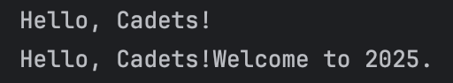
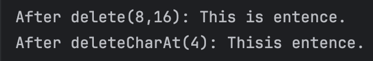
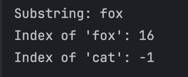
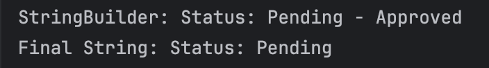

# Name: Francis Aldrin Belmes
# Lab: Exploring Java StringBuilder
# Objective: To understand the mutable nature of the StringBuilder class and learn how to use its essential methods for efficient string manipulation.
***
## Exercise 1: append() - Appending Content
### Prediction:
Output would be "Hello, Cadets!". This is similar to concatenating strings but every String that's added is added at the end.
### Observation:
Output is actually "Hello, Cadets!". 

## Exercise 2: insert() - Inserting Content at a Position
### Prediction:
Output would be "Java is really great!" since it moved the succeeding characters from the offset index and inserted the input string.
### Observation:
Output is actually "Java is really great!" 

## Exercise 3: delete() - Deleting Content
### Prediction:
Output would be "After delete(8,16): This is entence" and "After deleteCharAt(4): Thisis entence". Similar to how substring works in String,it takes in the range of the index to be removed except for the character at the last indicated index.
### Observation:
Output is actually: 
"After delete(8,16): This is entence" 
"After deleteCharAt(4): Thisis entence" 

## Exercise 4: replace() - Replacing a Section
### Prediction:
Output would be "I like programming in PyJava". This is similar to how delete works but instead of deleting,it replaces the characters in the said range with the input string.
### Observation:
Output is actually "I like programming in PyJava" 

## Exercise 5: Method Chaining
### Prediction:
Output would be "Ready,Set,St...". Java reads the code from left to right so the order of operation would be append->insert->delete.
### Observation:
Output is actually "Ready,Set, St..." 

## Exercise 6: substring(), indexOf(), and Non-Existing Words
### Prediction:
Output would be: "Substring: fox","Index of 'fox': 16",and "Index of 'cat': -1". It's the same methods used in String.
### Observation:
Output is actually: 
"Substring: fox" 
"Index of 'fox': 16" 
"Index of 'cat': -1" 

## Exercise 7: toString() - Converting back to a String
### Prediction:
Output would be "StringBuilder: Status: Pending - Approved" and "Final String: Status: Pending". This is similar to the wrapper objects method used to convert objects to strings.
### Observation:
Output is actually: 
"StringBuilder: Status: Pending - Approved" 
"Final String: Status: Pending" 
